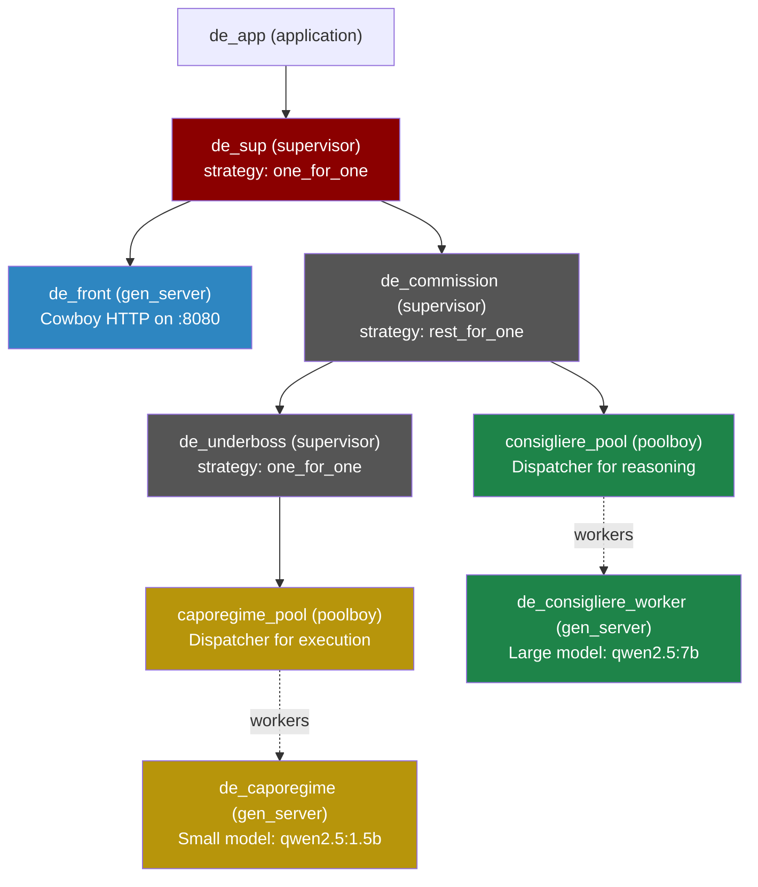
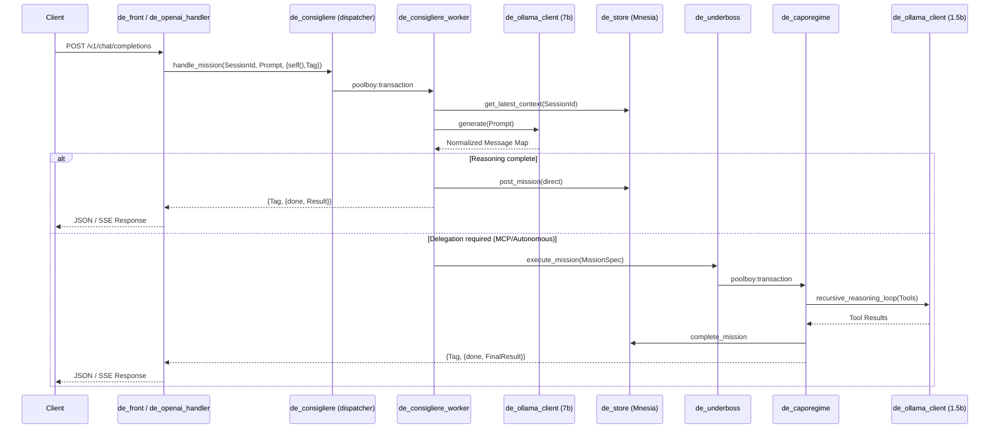

# Next steps:
- "The Wire"
- Phoenix dashboard
- Telemetry (Core Integrated)
- BEAM VM cluster 
- Swarm Timeline - Coordination
- Document processing
- Decoupled context

# Don Erleone — Architecture

> **An Erlang/OTP agentic AI orchestrator with a Mafia-themed supervision hierarchy.**
> Exposes an OpenAI-compatible HTTP API, routes user prompts through a "reasoning" LLM,
> and delegates infrastructure tasks to "execution" workers powered by a smaller LLM.

---

## 1. Supervision Tree

The system is built on a robust OTP hierarchy designed for fault tolerance and clear separation of concerns.



**Key design choice:** `de_commission` uses `rest_for_one`. The `de_underboss` (execution layer) starts *first*. If it crashes, the reasoning pool is also restarted — preventing workers from holding stale references to dead execution workers.

---

## 2. Request Flow (Pipelined Execution)

The system uses an asynchronous reply pattern to decouple HTTP request lifecycles from worker pools.



---

## 3. Module Details (The DE Standard)

All modules follow a strict functional decomposition pattern, separating mailbox management (GenServers) from pure logic (Stateless modules).

| Module | OTP Behaviour | Role |
|---|---|---|
| `de_app` | `application` | Boots the OTP application. |
| `de_sup` | `supervisor` | Top-level supervisor; manages Ingress and Core. |
| `de_front` | `gen_server` | Owns the Cowboy HTTP listener. |
| `de_openai_handler` | cowboy handler | Normalizes requests to OpenAI format. |
| `de_consigliere` | stateless | Dispatcher for reasoning tasks. |
| `de_consigliere_worker`| `gen_server` | Reasoning worker; orchestrates LLM calls. |
| `de_commission` | `supervisor` | Manages shared fate between reasoning and execution. |
| `de_underboss` | `supervisor` | Owns and supervises the execution pool. |
| `de_caporegime` | `gen_server` | Execution worker; handles MCP tool discovery and loops. |
| `de_ollama_client` | stateless | Pipelined HTTP client for Ollama. |
| `de_agent_brain` | stateless | Pure logic for interpreting LLM outputs and tools. |
| `de_store` | stateless | Mnesia abstraction layer with transaction safety. |
| `de_telemetry` | stateless | Centralized telemetry and metrics setup. |

---

## 4. Data Standards & Persistence

Mnesia is used for session and mission persistence. The primary record is defined in `de_store.erl`.

```erlang
-record(mission, {
  id,              %% unique monotonic integer
  session_id,      %% binary session identifier
  intent,          %% current mission goal
  raw_prompt,      %% original user input
  status,          %% pending | in_progress | completed | failed
  result,          %% final execution payload
  error,           %% failure reason
  context_tokens,  %% conversational memory
  timestamp        %% system time
}).
```

---

## 5. Testing & Observability

### Test Suite
The system includes a granular unit test suite (85+ tests) following the **Macro-List Style**. Tests are designed to be quiet and isolated using `logger` configuration management.

```bash
# Run the full suite
rebar3 eunit
```

### Telemetry
All core operations emit `telemetry` events for monitoring performance and failure rates:
- `[don_erleone, worker, execute, start/stop/exception]`
- `[don_erleone, ollama, request, start/stop/error]`

---

# License

        Don Erleone - Erlang Orchestrator for Agentic Swarm
        Copyright (C) 2026 Tommy (Thae Hyun) Nam <tommynam1994@gmail.com>

        This program is free software: you can redistribute it and/or modify
        it under the terms of the GNU Affero General Public License as
        published by the Free Software Foundation, either version 3 of the
        License, or (at your option) any later version.

        This program is distributed in the hope that it will be useful,
        but WITHOUT ANY WARRANTY; without even the implied warranty of
        MERCHANTABILITY or FITNESS FOR A PARTICULAR PURPOSE.  See the
        GNU Affero General Public License for more details.

        You should have received a copy of the GNU Affero General Public License
        along with this program.  If not, see <https://www.gnu.org/licenses/>.